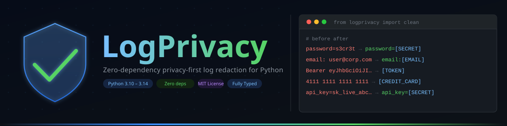
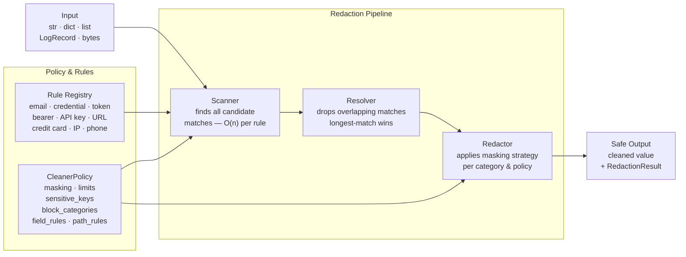
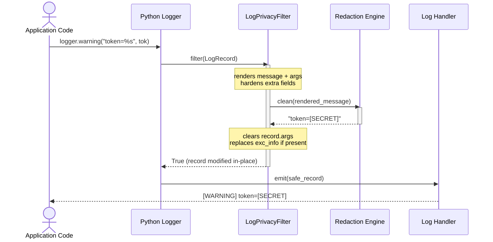
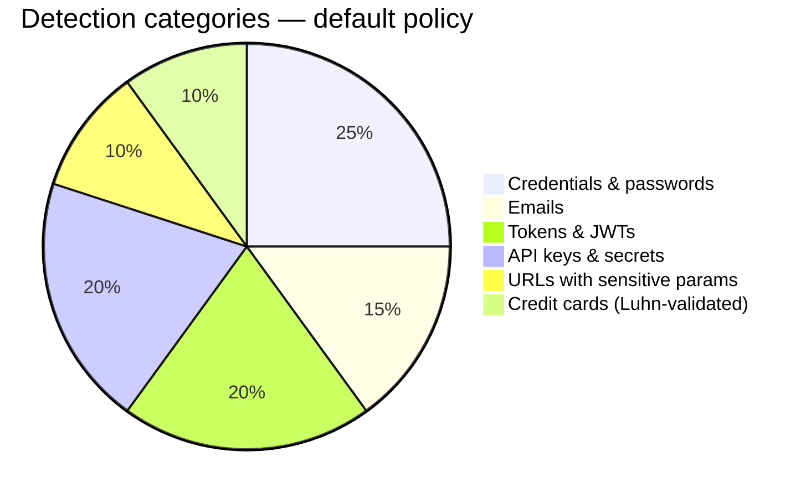
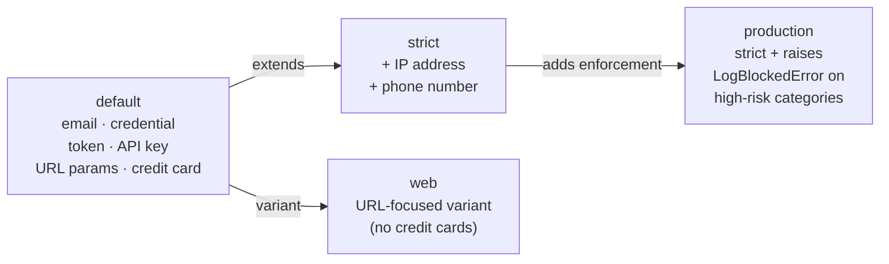

<p align="center">
  
</p>

<p align="center">
  <a href="https://github.com/igors93/logprivacy/actions/workflows/ci.yml">
    
  </a>
  <a href="https://pypi.org/project/logprivacy/">
    
  </a>
  <a href="https://pypi.org/project/logprivacy/">
    
  </a>
  <a href="https://github.com/igors93/logprivacy">
    
  </a>
  <a href="https://mypy.readthedocs.io/">
    
  </a>
  <a href="https://github.com/igors93/logprivacy">
    
  </a>
  <a href="LICENSE">
    
  </a>
</p>

---

**For beginners:** Every developer has accidentally logged a password, API key, or email address. LogPrivacy adds one import to your project and prevents those accidents automatically — no infrastructure changes, no configuration required.

**For advanced teams:** LogPrivacy implements a three-phase redaction pipeline (scan → resolve overlaps → redact) with configurable policy composition, HMAC pseudonymization, declarative JSON policies, structured traversal with depth/item budgets, and fail-closed semantics throughout. Zero runtime dependencies. Fully typed.

Works on **Linux, macOS, and Windows** · **Python 3.10–3.14** · Zero third-party dependencies

---

## The problem in two lines

```python
# What happens WITHOUT LogPrivacy
logger.warning("Login failed for user=%s token=%s", email, api_token)
# → WARNING: Login failed for user=john@company.com token=sk_live_abc123XYZ
```

```python
# What happens WITH LogPrivacy
logger = get_safe_logger(__name__)
logger.warning("Login failed for user=%s token=%s", email, api_token)
# → WARNING: Login failed for user=[EMAIL] token=[SECRET]
```

---

<details>
<summary><strong>Table of Contents</strong></summary>

- [How It Works](#how-it-works)
- [Installation](#installation)
- [Which API should I use?](#which-api-should-i-use)
- [Quick Start](#quick-start)
- [Safe Print](#safe-print)
- [Safe Logger](#safe-logger)
- [Audit Before Logging](#audit-before-logging)
- [Fail Tests When Logs Are Unsafe](#fail-tests-when-logs-are-unsafe)
- [Clean Structured Data](#clean-structured-data)
- [Structured and JSON-safe Data](#structured-and-json-safe-data)
- [JSONL Streaming](#jsonl-streaming)
- [Clean URLs](#clean-urls)
- [Masking Styles](#masking-styles)
- [Policies](#policies)
- [Path Rules and Pseudonymization](#path-rules-and-pseudonymization)
- [Clean Log Files](#clean-log-files)
- [CLI](#cli)
- [What It Protects Against](#what-it-protects-against)
- [Security Disclaimer](#security-disclaimer)
- [Development](#development)
- [Design Goals](#design-goals)

</details>

---

## How It Works

Every value you pass to LogPrivacy goes through a three-phase pipeline before being returned to you. Understanding this makes it easier to predict behavior, write custom rules, and tune performance.



**Scanner** — Each rule runs `finditer` (or `find_limited`) over the text and reports candidate matches with their category, start, and end positions.

**Resolver** — When two rules match overlapping spans (e.g. an email inside a URL), the resolver keeps the longest non-overlapping match. Ties are broken by rule order.

**Redactor** — Applies the configured masking strategy (`placeholder`, `partial`, or `hash`) for each winning match, and assembles the final sanitized string.

Structured values (dicts, lists, dataclasses, exceptions) are traversed recursively. The same pipeline runs on every leaf string, with configurable depth and item budgets.

### From log record to safe output

The sequence below shows exactly how a `logger.warning()` call flows through the redaction filter before reaching any handler.



The filter modifies the `LogRecord` **in place** and clears `.args` so the original sensitive values cannot be recovered downstream by any handler.

### What gets detected



> Strict policy additionally detects IP addresses and phone numbers. See [Policies](#policies).

---

## Installation

```bash
pip install logprivacy
```

Requires Python 3.10 or later. No other dependencies.

---

## Which API should I use?

| I want to… | Use |
|---|---|
| Clean a string, dict, list, or any value | `clean()` |
| Print safely during debugging | `safe_print()` |
| Use Python's `logging` module safely | `get_safe_logger()` |
| Inspect what would be redacted without modifying | `audit()` |
| Fail a test when a log message leaks a secret | `assert_clean()` |
| Sanitize a URL while keeping safe query params | `clean_url()` |
| Scan or clean an old log file | `scan_file()` / `clean_file()` |
| Stream or clean a JSONL file | `scan_jsonl()` / `clean_jsonl()` |
| Get full result metadata alongside cleaned output | `clean_with_result()` / `to_safe_data_with_result()` |
| Serialize structured data safely for JSON / APIs | `to_safe_data()` / `safe_json_dumps()` |

See [docs/guides/which-api.md](docs/guides/which-api.md) for a longer decision guide.

---

## Quick Start

```python
from logprivacy import clean

message = "Login failed for john@example.com with password=123456"
print(clean(message))
# Login failed for [EMAIL] with password=[SECRET]
```

`clean()` accepts strings, dicts, lists, tuples, dataclasses, exceptions, bytes, and most standard Python types. The return type matches the input type.

---

## Safe Print

A drop-in replacement for `print()` during debugging. Nothing sensitive ever reaches your terminal or captured output:

```python
from logprivacy import safe_print

user = {"email": "john@example.com", "token": "sk_live_abc123", "status": "active"}
safe_print("Payload:", user)
# Payload: {'email': '[EMAIL]', 'token': '[SECRET]', 'status': 'active'}
```

Supports all `print()` arguments (`sep`, `end`, `file`, `flush`).

---

## Safe Logger

Wraps any Python `logging.Logger` with a redaction filter. **Your logging setup stays unchanged** — you only swap how you get the logger:

```python
import logging
from logprivacy import get_safe_logger

logging.basicConfig(level=logging.INFO)
logger = get_safe_logger(__name__)

logger.warning("User john@example.com used password=123456")
# WARNING:__main__:User [EMAIL] used password=[SECRET]

# Works with structured extra fields too
logger.info("Request complete", extra={"auth_token": "Bearer abc123xyz"})
# extra fields are cleaned before any handler sees the record
```

The filter is attached once per logger name. Calling `get_safe_logger()` again on the same name reuses the existing filter without creating a duplicate.

**Exception tracebacks** are also sanitized — if an exception message contains a secret, it is cleaned before any handler formats the record.

---

## Audit Before Logging

Inspect what would be redacted **without modifying the input**. Useful for routing logic, metrics, or conditional alerting:

```python
from logprivacy import audit

report = audit({"password": "123456", "email": "john@example.com"})

print(report.safe)          # False
print(report.risk_level)    # "high"
print(report.categories)    # ("credential", "email")
print(report.describe())
# Sensitive data detected at ['password', 'email']:
#   [credential] at path password — sensitive key
#   [email]      at path email    — matched email pattern
```

`audit()` traverses dicts, lists, and tuples recursively. Sensitive dictionary keys (like `"password"`, `"api_key"`, `"secret"`) are always reported as `credential` findings even when the value does not match any text pattern.

---

## Fail Tests When Logs Are Unsafe

Integrate LogPrivacy into your test suite to make sensitive leaks a **test failure**, not a production incident:

```python
from logprivacy import assert_clean

def test_log_message_has_no_sensitive_data():
    assert_clean("operation finished successfully")  # passes

def test_response_dict_is_safe():
    assert_clean({"username": "john", "status": "active"})  # passes

def test_catches_accidental_leak():
    assert_clean("sent to john@company.com with token=abc123")
    # raises LogPrivacyAssertionError:
    # Sensitive data found in 2 location(s):
    #   [email]      at root — matched email pattern
    #   [credential] at root — matched secret pattern
```

`assert_clean()` raises `LogPrivacyAssertionError` with a human-readable description of every finding, including its path in nested structures.

---

## Clean Structured Data

```python
from logprivacy import clean

payload = {
    "user": {
        "email": "john@example.com",
        "password": "s3cr3t",
    },
    "metadata": {
        "request_id": "req-abc123",
        "status": "failed",
    },
}

print(clean(payload))
# {
#   'user': {'email': '[EMAIL]', 'password': '[SECRET]'},
#   'metadata': {'request_id': 'req-abc123', 'status': 'failed'}
# }
```

Nested structures are traversed recursively up to a configurable depth limit (default: 20). Sensitive dictionary keys (`password`, `api_key`, `secret`, etc.) are redacted even when the value does not match a regex pattern.

---

## Structured and JSON-safe Data

Use `to_safe_data()` when the output must be safe to pass to JSON encoders or external APIs. It converts supported Python types recursively and **fails closed** for unsupported objects — no sensitive data leaks via `repr()` or `str()`:

```python
from logprivacy import (
    AdapterRegistry,
    CleanerPolicy,
    FieldRule,
    safe_json_dumps,
    to_safe_data,
    to_safe_data_with_result,
)

# Basic usage
to_safe_data({"email": "john@example.com", "password": "123"})
# {"email": "[EMAIL]", "password": "[SECRET]"}

# Direct JSON serialization
safe_json_dumps({"token": "abc123456789"})
# '{"token": "[SECRET]"}'

# Custom type adapter — teach LogPrivacy how to convert your domain objects
class Request:
    def __init__(self, identifier: str, token: str) -> None:
        self.identifier = identifier
        self.token = token

adapters = AdapterRegistry.default()
adapters.register(Request, lambda v: {"id": v.identifier, "token": v.token})
to_safe_data(Request("req-1", "abc123456789"), adapters=adapters)
# {"id": "req-1", "token": "[SECRET]"}

# Field-level rules — fine-grained control per field name
policy = CleanerPolicy.default().add_field_rules(
    FieldRule.exact("raw_body", action="truncate", max_chars=500),
    FieldRule.contains("secret", action="remove"),
)

# Completeness metadata — know when output is partial
result = to_safe_data_with_result({"token": "abc", "name": "Alice"})
print(result.complete)        # True  — all fields processed
print(result.stats.masked)    # 1     — one value was masked
print(result.stats.removed)   # 0
```

See [docs/data/structured-data.md](docs/data/structured-data.md) for supported types, field-rule actions, adapters, and JSON serialization details.

---

## JSONL Streaming

Process JSONL (newline-delimited JSON) files line by line without loading the entire file into memory:

```python
from logprivacy import scan_jsonl, clean_jsonl, iter_safe_jsonl, safe_jsonl_write

# Scan for findings without modifying the file
stats = scan_jsonl("app.jsonl")
print(stats.total_lines, stats.affected_lines)

# Clean atomically — writes to a temp file, then os.replace()
# The original is never partially overwritten on failure
clean_jsonl("app.jsonl", output="app.clean.jsonl")

# Stream cleaned records one at a time (memory-efficient)
for record in iter_safe_jsonl("app.jsonl"):
    forward_to_downstream(record)

# Write clean records directly
with open("output.jsonl", "w") as f:
    safe_jsonl_write([{"email": "john@example.com", "status": "ok"}], f)
```

---

## Clean URLs

Sanitize sensitive query parameters while keeping safe context readable:

```python
from logprivacy import clean_url

url = "https://api.example.com/users?page=1&token=abc123&email=john@example.com"
print(clean_url(url))
# https://api.example.com/users?page=1&token=[SECRET]&email=[EMAIL]
```

Safe parameters like `page`, `sort`, and `limit` are preserved unchanged. Sensitive ones — `token`, `api_key`, `email`, `password`, and any key that matches `sensitive_keys` in your policy — are replaced with placeholders.

---

## Masking Styles

Three built-in strategies are available. Choose based on what you need to preserve:

```python
from logprivacy import Cleaner, CleanerPolicy

# Placeholder (default) — maximum privacy, minimum context
Cleaner(CleanerPolicy.default(masking="placeholder"))

# Partial — shows prefix/suffix, useful for correlation without exposure
Cleaner(CleanerPolicy.default(masking="partial"))

# Hash — stable opaque token, same input always gives same output
Cleaner(CleanerPolicy.default(masking="hash"))
```

| Input | `placeholder` | `partial` | `hash` |
|---|---|---|---|
| `john@example.com` | `[EMAIL]` | `j***@example.com` | `[EMAIL:855f96e9]` |
| `sk_live_abcdef123456` | `[SECRET]` | `sk_l********3456` | `[SECRET:3c6e0b8a]` |
| `Bearer eyJhbGci...` | `[TOKEN]` | `[TOKEN]` | `[TOKEN:7f4a1b2c]` |

### HMAC pseudonymization

For cases where you need **stable, reversible tokens** without exposing the original value — compliance logging, analytics across services, A/B testing:

```python
from logprivacy import HMACMaskingStrategy, CleanerPolicy

policy = CleanerPolicy.default().with_pseudonymizer(
    HMACMaskingStrategy(key=b"your-32-byte-minimum-secret-key!")
)
clean("john@example.com", policy=policy)
# → [EMAIL:hmac:3f4a7c2d]

# Same input + same key = same token, always
# Different key = entirely different tokens (key rotation)
```

The HMAC key is **never** stored in `repr()`, `str()`, serialization, or exception messages.

---

## Policies

LogPrivacy ships four ready-made policies. All are fully composable — you can extend any of them with custom rules or field/path rules.



| Policy | Active rules | Use when |
|---|---|---|
| `CleanerPolicy.default()` | email, credentials, tokens, API keys, URLs, credit cards | General-purpose — safe default for any project |
| `CleanerPolicy.strict()` | everything above + IP addresses + phone numbers | Healthcare, finance, high-sensitivity environments |
| `CleanerPolicy.web()` | URLs, credentials, tokens, secrets | HTTP access log processing |
| `CleanerPolicy.production()` | strict + raises `LogBlockedError` on high-risk | CI gates, production safety checks |

```python
from logprivacy import Cleaner, CleanerPolicy

# Strict mode: also catches IP addresses and phone numbers
cleaner = Cleaner(CleanerPolicy.strict())

# Production mode: raises instead of masking on critical categories
# Ideal for CI pipelines or zero-tolerance environments
cleaner = Cleaner(CleanerPolicy.production())
```

See [docs/core/policies.md](docs/core/policies.md) for full details on each policy.

---

## Path Rules and Pseudonymization

`PathRule` matches fields by their **full traversal path** and takes precedence over `FieldRule` and `sensitive_keys`. Use glob patterns to match lists and nested structures:

```python
from logprivacy import CleanerPolicy, PathRule

policy = CleanerPolicy.default().add_path_rules(
    PathRule.exact("user.email",            action="mask"),
    PathRule.glob("orders.*.card_number",   action="remove"),
    PathRule.exact("debug.raw_body",        action="truncate", max_chars=200),
    PathRule.exact("auth.token",            action="block"),   # raises LogBlockedError
)

# Pseudonymize specific fields with HMAC
from logprivacy import HMACMaskingStrategy

policy = policy.with_pseudonymizer(HMACMaskingStrategy(key=b"..."))
policy = policy.add_path_rules(
    PathRule.exact("user.id", action="pseudonymize"),
)
```

### Declarative JSON policies

Policies can be **serialized to and from JSON**, enabling configuration-driven deployments without code changes:

```python
# Serialize
json_str = policy.to_json()

# Deserialize (e.g., load from a config file or environment variable)
policy2 = CleanerPolicy.from_json(json_str)

# Or from a dict (useful with YAML/TOML loaders)
policy3 = CleanerPolicy.from_dict({
    "schema_version": 1,
    "base": "strict",
    "masking": "hash",
    "sensitive_keys": ["internal_id", "trace_token"],
    "field_rules": [
        {"match": "raw_body", "mode": "exact", "action": "truncate", "max_chars": 500}
    ],
})
```

See [docs/data/structured-data.md](docs/data/structured-data.md) for path-rule glob syntax, precedence rules, and the `allow_paths` allowlist.

---

## Clean Log Files

Scan or sanitize existing log files on disk:

```python
from logprivacy import scan_file, clean_file

# Inspect without modifying
report = scan_file("app.log")
print(report.describe())

# Clean atomically (writes to temp file, then replaces)
clean_file("app.log", output="app.clean.log")

# In-place cleaning
clean_file("app.log")
```

---

## CLI

```bash
# Scan a log file — prints a summary of findings
python -m logprivacy scan app.log

# Clean a log file — outputs sanitized copy
python -m logprivacy clean app.log --output app.clean.log

# Clean a single string inline
python -m logprivacy text "email=john@example.com password=s3cr3t"
# email=[EMAIL] password=[SECRET]
```

---

## What It Protects Against

| Category | Example input | Output |
|---|---|---|
| Email addresses | `john@example.com` | `[EMAIL]` |
| Passwords and credentials | `password=123456` | `password=[SECRET]` |
| API keys and access tokens | `api_key=sk_live_abc` | `api_key=[SECRET]` |
| Bearer tokens and JWTs | `Authorization: Bearer eyJ...` | `[TOKEN]` |
| Generic secrets | `secret=abc123456789` | `[SECRET]` |
| Sensitive URL query params | `?token=abc123` | `?token=[SECRET]` |
| Credit card numbers (Luhn) | `4111111111111111` | `[CREDIT_CARD]` |
| IP addresses *(strict mode)* | `192.168.1.1` | `[IP_ADDRESS]` |
| Phone numbers *(strict mode)* | `+1-800-555-0100` | `[PHONE]` |

---

## Security Disclaimer

LogPrivacy reduces accidental sensitive-data exposure in logs. It is a **safety net**, not a DLP system.

- **Regex-based detection has false positives and false negatives.** Novel secret formats, obfuscated values, or custom encodings may not be detected. Always review findings in your specific context.
- **Avoid logging sensitive data in the first place.** LogPrivacy is the second control, not the first. Structure your code so secrets never reach log calls.
- **It does not replace secret management, encryption, access control, or legal privacy review.** Compliance with GDPR, HIPAA, or PCI-DSS requires a legal assessment that goes beyond log redaction.
- `CleanerPolicy.production()` turns silent leaks into loud failures — use it as a third control in CI and production to catch regressions early.

See [docs/security/security-model.md](docs/security/security-model.md) for the full security model and threat boundaries.

---

## Development

### Setup

**Linux / macOS:**

```bash
python3 -m venv .venv
source .venv/bin/activate
python3 -m pip install --upgrade pip
python3 -m pip install -e ".[dev]"
```

**Windows (PowerShell):**

```powershell
python -m venv .venv
.venv\Scripts\Activate.ps1
python -m pip install --upgrade pip
python -m pip install -e ".[dev]"
```

### Run all checks

```bash
./scripts/ci.sh
```

### Individual commands

```bash
python -m ruff format .          # format code
python -m ruff check . --fix     # lint and auto-fix
python -m ruff format --check .  # verify formatting
python -m ruff check .           # lint only
python -m mypy src               # type check
python -m pytest -v              # run tests (742 tests)
python -m build                  # build distribution
```

### CI matrix

| OS | Python versions |
|---|---|
| Linux (ubuntu-latest) | 3.10, 3.11, 3.12, 3.13, 3.14 |
| macOS (macos-latest) | 3.10, 3.11, 3.12, 3.13, 3.14 |
| Windows (windows-latest) | 3.10, 3.11, 3.12, 3.13 |

Python 3.14 is a pre-release; Windows support is added when it reaches GA.

---

## Design Goals

1. **Simple things should be simple** — `pip install logprivacy` + one import is enough to get started.
2. **Advanced usage should be composable** — policies, rules, strategies, and path rules all layer cleanly.
3. **Logs should be safe by default** — sensitive keys are redacted even without regex matches.
4. **Fail closed, not open** — when in doubt (unsupported type, iteration error, depth limit), return a safe placeholder rather than the original value.
5. **Output should be predictable and explainable** — every finding has a category, location, and reason.
6. **Runtime dependencies stay at zero** — no third-party packages, ever.
7. **You should not need to replace your logging setup** — the filter attaches to existing loggers.
8. **Security guidance should be honest** — this library reduces risk, it does not replace a DLP system.

---

## Status

Beta. The core API (`clean`, `audit`, `assert_clean`, `safe_print`, `get_safe_logger`, `clean_url`) is stable. Advanced features (path rules, JSONL, HMAC pseudonymization, declarative policies) are in active use.

See [CHANGELOG.md](CHANGELOG.md) for the full history.
